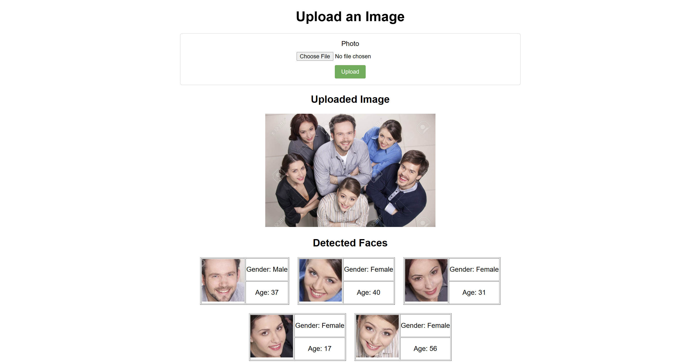
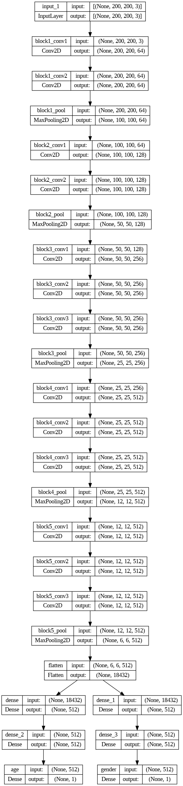

# Age and Gender Classification Web App

This is a web application that detects faces in uploaded images and predicts the **age** and **gender** of each detected face using a deep learning model built on top of the pre-trained VGG16 architecture.

---

## 🔗 Live Demo

Want to try it out right away?  
👉 **Check out the Streamlit version here:** [Click here](https://age-and-gender-detection-rahul5r.streamlit.app/)

> No setup needed — just upload your image and see the results in seconds!

---

## 🔍 Overview

The app performs the following:

- Detects faces in an uploaded image using a Haar Cascade classifier.
- For each detected face, predicts:
  - **Age** (as a continuous value)
  - **Gender** (Male/Female)
- Displays cropped face images along with predictions.

---

## 🚀 Features

- ✅ Upload images (PNG, JPG, JPEG, GIF, WebP)
- ✅ Detect multiple faces in one image
- ✅ Predict both age and gender
- ✅ Clean, user-friendly interface
- ✅ High accuracy with a lightweight model
- ✅ **Streamlit version available online**

---

## 📊 Model Performance

Final training epoch metrics:

| Metric              | Train Set | Validation Set |
|---------------------|-----------|----------------|
| **Age MAE**         | 7.93 yrs  | 8.07 yrs       |
| **Gender Accuracy** | 84.06%    | 84.25%         |

> The model achieves solid performance for gender classification with over 84% accuracy, and estimates age with an average error of ~8 years.

---

## 🛠️ Tech Stack

- **Frontend:** HTML/CSS (Flask Templates), Streamlit
- **Backend:** Python, Flask
- **ML Framework:** TensorFlow / Keras
- **Face Detection:** OpenCV Haar Cascade Classifier
- **Model Base:** VGG16 (pre-trained on ImageNet, frozen layers)

---

## 📷 App Screenshot

---

## 🧬 Model Architecture (Visual)

---
